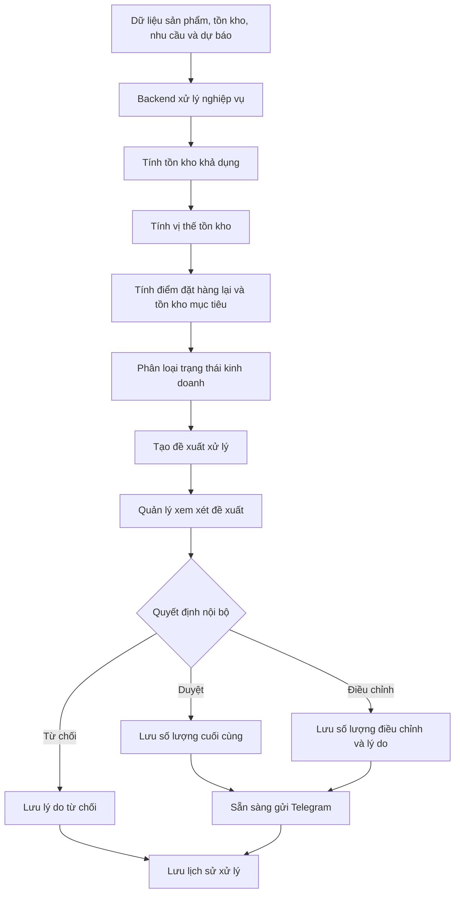
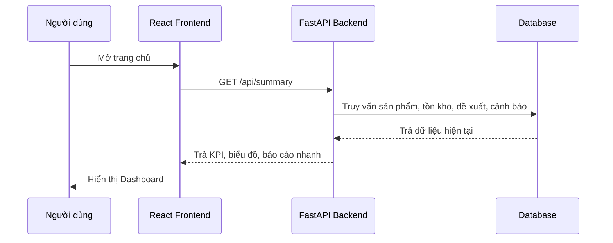
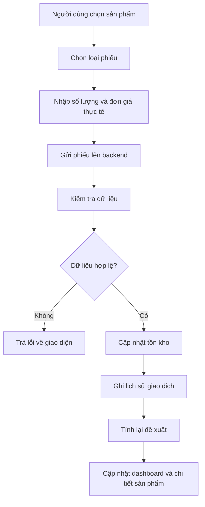
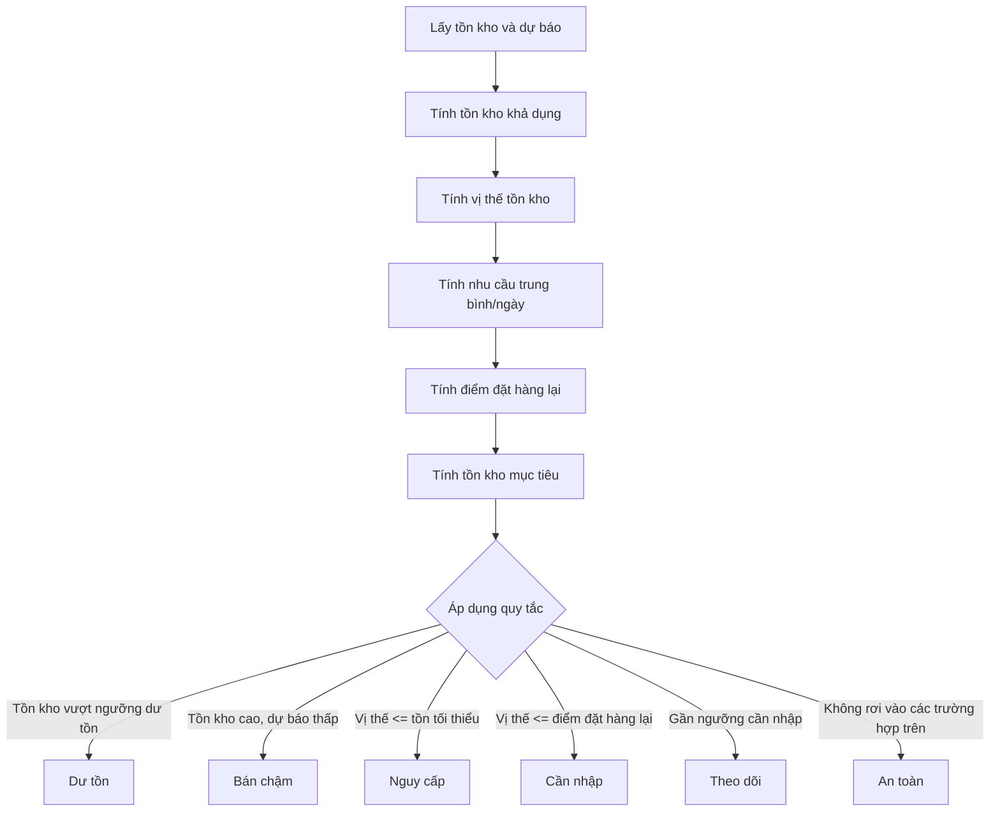
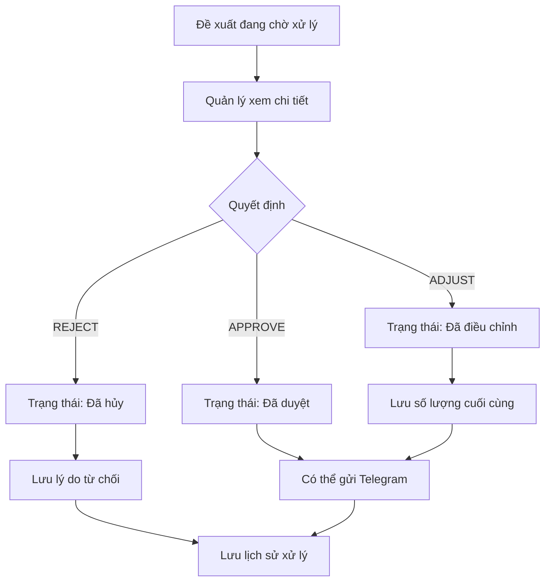
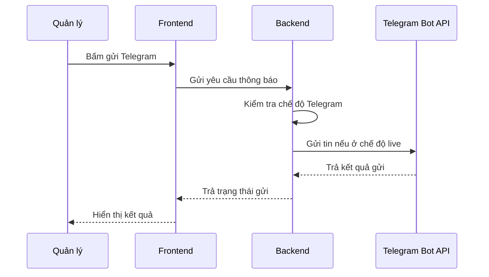
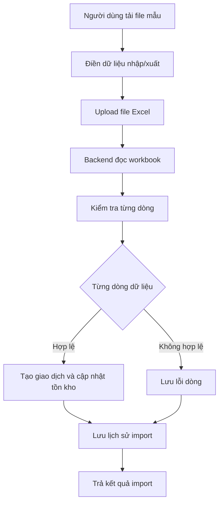
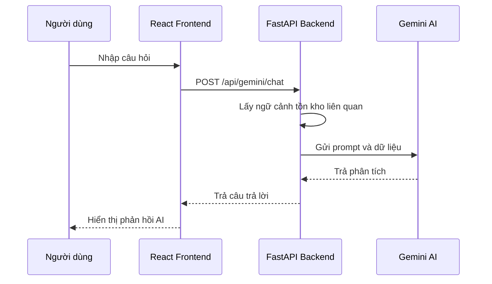
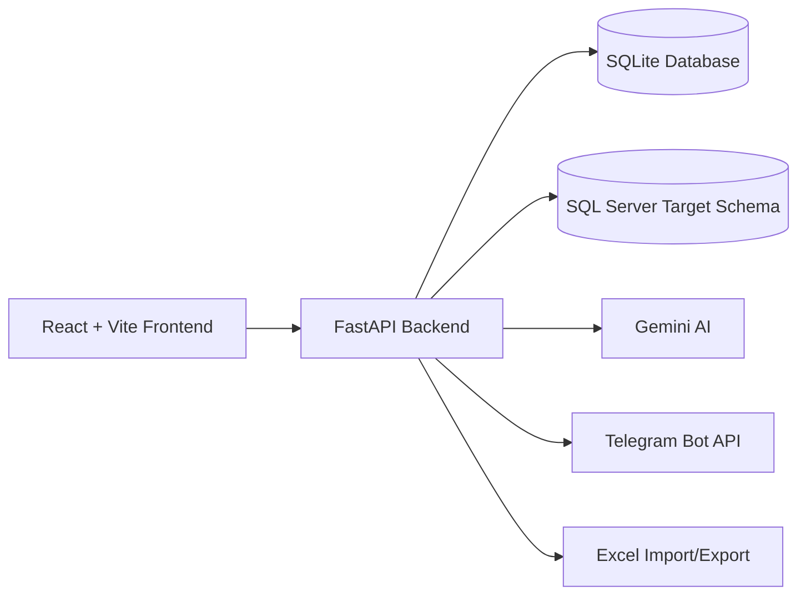
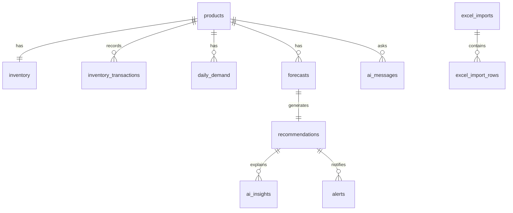

# Inventory DSS

---

## Phần 1. Định hướng đề tài, nghiệp vụ và lưu ý viết báo cáo

## Inventory DSS – Hệ thống hỗ trợ quản lý tồn kho bán lẻ

README này dùng cho cả nhóm đọc trước khi chạy hệ thống và viết báo cáo. Mục tiêu là thống nhất cách hiểu nghiệp vụ, phạm vi đề tài, cách trình bày trong báo cáo và các điểm cần tránh để không viết sai hoặc viết thừa.

---

### 1. Tên đề tài

## **Hệ thống hỗ trợ ra quyết định ứng dụng trí tuệ nhân tạo trong dự báo nhu cầu và tối ưu tồn kho cho cửa hàng bán lẻ**

### 2. Mục tiêu hệ thống

Hệ thống minh họa cách **hệ thống thông tin quản lý** hỗ trợ nhà quản lý trong hoạt động tồn kho bán lẻ.

Mục tiêu chính:

1. Ghi nhận dữ liệu sản phẩm, tồn kho, giá nhập, giá bán và giao dịch kho.
2. Theo dõi biến động nhập hàng, xuất bán, điều chỉnh kiểm kê, hàng lỗi/hủy và điều chuyển chi nhánh.
3. Phân tích nhu cầu bán theo thời gian để phát hiện sản phẩm thiếu hàng, cần nhập, dư tồn hoặc bán chậm.
4. Tạo Dashboard và báo cáo nhanh cho quản lý.
5. Gợi ý phương án xử lý tồn kho: nhập thêm, điều chuyển, khuyến mãi, tạm dừng nhập hoặc theo dõi thêm.
6. Hỗ trợ hỏi đáp bằng Gemini để quản lý hiểu nhanh tình hình tồn kho, giá trị vốn, doanh thu và lợi nhuận dự kiến.
7. Gửi thông báo tổng hợp hoặc thông báo chi tiết qua Telegram.
8. Xuất file báo cáo Excel để lưu trữ, gửi nội bộ hoặc đưa vào phụ lục báo cáo.

Điểm quan trọng: hệ thống không chỉ xử lý thiếu hàng để đề xuất nhập thêm, mà còn xử lý **dư tồn** và **bán chậm**.

---

### 3. Phạm vi đề tài

#### Hệ thống có làm

- Quản lý danh mục sản phẩm.
- Quản lý tồn kho hiện tại.
- Ghi nhận phiếu nhập hàng.
- Ghi nhận phiếu xuất bán.
- Ghi nhận phiếu điều chỉnh kiểm kê.
- Ghi nhận phiếu hàng lỗi/hủy.
- Ghi nhận phiếu điều chuyển chi nhánh.
- Nhập dữ liệu từ file Excel.
- Theo dõi nhu cầu bán theo ngày.
- Tính toán đề xuất xử lý tồn kho.
- Phân loại trạng thái tồn kho bằng màu sắc.
- Hiển thị Dashboard cho quản lý.
- Hỗ trợ hỏi đáp Gemini.
- Gửi thông báo Telegram.
- Tải báo cáo Excel.

#### Hệ thống không trình bày là

Không nên trình bày hệ thống này là:

- ERP hoàn chỉnh.
- Phần mềm kế toán.
- Website bán hàng online.
- Hệ thống quản lý vận tải/logistics.
- Hệ thống quản lý khách hàng CRM.
- Hệ thống triển khai thật cho toàn bộ chuỗi cửa hàng.
- Hệ thống dự báo bằng Deep Learning, LSTM hoặc Transformer.
- Hệ thống AI tự động ra quyết định thay con người.


> Hệ thống là mô hình ứng dụng HTTTQL/DSS trong quản lý tồn kho bán lẻ, tập trung vào thu thập dữ liệu, xử lý dữ liệu, trực quan hóa thông tin, đề xuất xử lý tồn kho và hỗ trợ quản lý ra quyết định.

---

### 4. Người dùng trong hệ thống

| Người dùng               | Vai trò                                                                                              |
| ------------------------ | ---------------------------------------------------------------------------------------------------- |
| Quản lý cửa hàng         | Xem Dashboard, xem báo cáo nhanh, duyệt/điều chỉnh/hủy đề xuất, gửi thông báo, xem chi tiết sản phẩm |
| Nhân viên kho            | Lập phiếu nhập/xuất, điều chỉnh kiểm kê, nhập file Excel, ghi nhận đơn giá thực tế                   |
| Cấp trên/quản lý cấp cao | Nhận thông báo Telegram và file báo cáo tổng hợp                                                     |
| Hệ thống                 | Xử lý dữ liệu, phân loại trạng thái tồn kho, sinh đề xuất, cập nhật báo cáo                          |
| Gemini                   | Hỗ trợ hỏi đáp và diễn giải thông tin quản trị bằng ngôn ngữ tự nhiên                                |

Lưu ý khi viết báo cáo: người ra quyết định cuối cùng vẫn là con người. Hệ thống chỉ hỗ trợ cung cấp thông tin, cảnh báo và đề xuất.

---

### 5. Luồng nghiệp vụ tổng quát

```text
Dữ liệu sản phẩm / tồn kho / giá / nhu cầu bán
→ Hệ thống xử lý dữ liệu
→ Phân loại trạng thái tồn kho
→ Tạo đề xuất xử lý
→ Quản lý xem báo cáo và quyết định
→ Nhân viên kho lập phiếu hoặc nhập file Excel
→ Dashboard và báo cáo được cập nhật lại
→ Gửi thông báo hoặc xuất báo cáo khi cần
```

Theo mô hình HTTTQL:

| Thành phần | Thể hiện trong đề tài                                                                               |
| ---------- | --------------------------------------------------------------------------------------------------- |
| Input      | Sản phẩm, tồn kho, giá nhập, giá bán, phiếu kho, file Excel, nhu cầu bán                            |
| Process    | Kiểm tra dữ liệu, cập nhật tồn kho, tính tồn khả dụng, tính điểm đặt hàng lại, phân loại trạng thái |
| Output     | Dashboard, biểu đồ, báo cáo nhanh, đề xuất nhập hàng, cảnh báo dư tồn/bán chậm, file Excel          |
| Feedback   | Quản lý duyệt/điều chỉnh/hủy đề xuất, nhân viên cập nhật phiếu kho, dữ liệu được tính lại           |

---

### 6. Các trạng thái tồn kho cần hiểu đúng

| Trạng thái | Ý nghĩa quản lý                         | Hướng xử lý                                   |
| ---------- | --------------------------------------- | --------------------------------------------- |
| Nguy cấp   | Tồn kho rất thấp, có nguy cơ thiếu hàng | Ưu tiên nhập hoặc điều chuyển nhanh           |
| Cần nhập   | Tồn kho thấp hơn ngưỡng đặt hàng lại    | Lập kế hoạch nhập bổ sung                     |
| Dư tồn     | Tồn kho cao, vốn bị giữ trong hàng tồn  | Điều chuyển, khuyến mãi, giảm nhập kỳ sau     |
| Bán chậm   | Tồn còn nhiều nhưng nhu cầu thấp        | Tạm dừng nhập, khuyến mãi, combo, điều chuyển |
| Theo dõi   | Chưa thiếu nhưng gần ngưỡng cần chú ý   | Theo dõi thêm trước khi quyết định            |
| An toàn    | Tồn kho đáp ứng nhu cầu hiện tại        | Duy trì theo dõi định kỳ                      |

Màu sắc trên Dashboard:

| Trạng thái | Màu        |
| ---------- | ---------- |
| Nguy cấp   | Đỏ         |
| Cần nhập   | Cam        |
| Dư tồn     | Xanh dương |
| Bán chậm   | Tím        |
| Theo dõi   | Vàng       |
| An toàn    | Xanh lá    |

Không viết rằng hệ thống chỉ dùng để đề xuất nhập hàng. Phải viết thêm rằng hệ thống cũng hỗ trợ xử lý dư tồn và bán chậm.

---

### 7. Logic xử lý tồn kho

Một số công thức có thể đưa vào báo cáo:

```text
Tồn khả dụng = Tồn kho thực tế - Số lượng đã giữ
```

```text
Vị thế tồn kho = Tồn kho thực tế - Số lượng đã giữ + Hàng đang về
```

```text
Điểm đặt hàng lại = Nhu cầu trung bình/ngày × Thời gian giao hàng + Tồn kho an toàn
```

```text
Số lượng đề xuất nhập = Tồn kho mục tiêu - Vị thế tồn kho
```

Nếu số lượng đề xuất nhỏ hơn 0 thì hệ thống không đề xuất nhập thêm.

---

### 8. Logic giá nhập, giá bán và đơn giá thực tế

Đây là phần dễ viết thiếu hoặc viết sai.

#### Giá trong danh mục sản phẩm

| Trường     | Ý nghĩa                                           |
| ---------- | ------------------------------------------------- |
| Giá nhập   | Giá vốn tham khảo/giá nhập hiện hành của sản phẩm |
| Giá bán    | Giá bán niêm yết hoặc giá bán thông thường        |
| Lãi gộp/SP | Giá bán - Giá nhập                                |

#### Giá trong từng phiếu kho

Ở thực tế, giá có thể thay đổi theo từng thời điểm:

- Nhà cung cấp tăng/giảm giá nhập.
- Cửa hàng bán ưu đãi cho khách hàng lớn.
- Có chương trình khuyến mãi.
- Điều chuyển hoặc hủy hàng thường tính theo giá vốn.

Vì vậy, mỗi phiếu kho có thêm:

```text
Đơn giá thực tế trên mỗi sản phẩm
Ghi chú về giá
Thành tiền
```

Ví dụ:

```text
SP001 - Áo thun nam cotton basic
Giá bán niêm yết: 129.000
Xuất cho khách hàng lớn: 115.000
Số lượng: 50
Thành tiền: 5.750.000
```

Cách viết đúng:

> Hệ thống không chỉ lưu giá bán và giá nhập trong danh mục sản phẩm, mà còn cho phép ghi nhận đơn giá thực tế ở từng giao dịch nhập/xuất. Điều này giúp phản ánh đúng tình huống giá nhập thay đổi hoặc cửa hàng bán ưu đãi cho khách hàng lớn.

---

### 9. Doanh thu, lợi nhuận và giá trị tồn kho

| Chỉ tiêu                | Cách hiểu                          |
| ----------------------- | ---------------------------------- |
| Giá trị vốn tồn kho     | Tồn kho × Giá nhập                 |
| Giá trị bán tồn kho     | Tồn kho × Giá bán                  |
| Doanh thu dự báo 7 ngày | Dự báo nhu cầu 7 ngày × Giá bán    |
| Lãi gộp/SP              | Giá bán - Giá nhập                 |
| Lãi gộp dự báo 7 ngày   | Dự báo nhu cầu 7 ngày × Lãi gộp/SP |

Các chỉ tiêu này giúp quản lý không chỉ biết sản phẩm thiếu hay dư, mà còn biết sản phẩm nào đang giữ nhiều vốn, sản phẩm nào có tiềm năng lợi nhuận cao.

---

### 10. Vai trò của Gemini

Gemini hỗ trợ quản lý hỏi đáp bằng ngôn ngữ tự nhiên.

Gemini có thể hỗ trợ:

- Giải thích vì sao sản phẩm cần nhập.
- So sánh nhiều sản phẩm.
- Hỏi sản phẩm nào đang giữ vốn nhiều.
- Hỏi sản phẩm nào có lãi gộp tốt.
- Hỏi sản phẩm nào nên ưu tiên nhập.
- Hỏi sản phẩm nào dư tồn và nên xử lý bằng khuyến mãi/điều chuyển.

Cách viết đúng:

> Gemini hỗ trợ diễn giải thông tin và trả lời câu hỏi quản trị, giúp người quản lý hiểu nhanh dữ liệu tồn kho và đề xuất xử lý.

Không viết:

- Gemini là lõi dự báo chính.
- Gemini tự quyết định nhập hàng.
- Gemini thay thế hoàn toàn nhà quản lý.
- Hệ thống dùng AI phức tạp để dự báo sâu.

---

### 11. Vai trò của Telegram

Telegram dùng để gửi thông báo và báo cáo cho cấp trên/quản lý.

#### Gửi thông báo chi tiết theo đề xuất

Sau khi quản lý duyệt hoặc điều chỉnh đề xuất, hệ thống có thể gửi thông báo chi tiết cho sản phẩm đó.

Nội dung gồm:

```text
Sản phẩm
Tình trạng
Xử lý nội bộ
Số lượng đề xuất/đã xử lý
Người xử lý
Lý do
```

#### Gửi báo cáo tổng hợp

Báo cáo Telegram được thiết kế gọn để tránh quá dài. Tin nhắn chỉ tóm tắt số lượng sản phẩm cần nhập, dư tồn/bán chậm và trạng thái xử lý. Chi tiết nằm trong file Excel đính kèm.

Lưu ý: bản này không dùng Telegram callback/webhook để phản hồi ngược về hệ thống vì chức năng đó cần domain public/webhook, không phù hợp khi chỉ chạy local.

---

### 12. Các màn hình chính

#### Trang chủ

Có các khối:

- Sản phẩm cần nhập.
- Dư tồn/bán chậm.
- Chờ xử lý nội bộ.
- Giá trị vốn tồn kho.
- Báo cáo nhanh cho quản lý.
- Trạng thái tồn kho theo màu.
- Top sản phẩm nguy cấp.
- Sản phẩm dư tồn/cần chiến lược.
- Nhập/xuất hàng theo ngày.
- Hỏi Gemini.
- Lịch sử thông báo.

Báo cáo nhanh có thời gian cập nhật và nút cập nhật lại báo cáo.

#### Xử lý đề xuất

Quản lý xem danh sách đề xuất và thực hiện:

```text
Duyệt
Điều chỉnh
Hủy
Gửi thông báo
```

#### Nhập hàng / Xuất hàng

Các loại phiếu:

```text
Phiếu nhập hàng
Phiếu xuất bán
Phiếu điều chỉnh kiểm kê
Phiếu hàng lỗi / hủy
Phiếu điều chuyển chi nhánh
```

Mỗi phiếu có số lượng, đơn giá thực tế và ghi chú giá.

#### Danh sách sản phẩm

Có thể lọc theo:

```text
Nguy cấp
Cần nhập
Dư tồn
Bán chậm
Theo dõi
An toàn
```

Chi tiết sản phẩm có danh mục, nhà cung cấp, giá nhập, giá bán, lãi gộp/SP, giá trị tồn kho, doanh thu dự báo, lãi gộp dự kiến, biểu đồ nhu cầu và biểu đồ nhập/xuất.

#### Nhập file Excel

File Excel có các cột:

```text
Ngày chứng từ
Loại phiếu
Mã sản phẩm
Tên sản phẩm
Số lượng
Đơn giá thực tế
Người nhập
Ghi chú
```

---

### 13. Dữ liệu hiện có trong hệ thống

Thông tin chính:

```text
25 sản phẩm
60 ngày nhu cầu bán / sản phẩm
Có dữ liệu tồn kho, giá nhập, giá bán
Có giao dịch nhập/xuất/điều chuyển/hủy
Có lịch sử nhập file Excel
Có đề xuất xử lý tồn kho
```

Không nên viết “chỉ có vài sản phẩm” hoặc “không có dữ liệu vận hành”, vì dữ liệu hiện tại đã đủ để trình bày các trường hợp quản lý chính.

---

### 14. Công nghệ sử dụng

| Thành phần          | Công nghệ             | Vai trò                                     |
| ------------------- | --------------------- | ------------------------------------------- |
| Frontend            | React + Vite          | Xây dựng Dashboard và giao diện người dùng  |
| Backend             | FastAPI               | Cung cấp API và xử lý nghiệp vụ             |
| Database local      | SQL Sever             | Lưu dữ liệu khi chạy local                  |
| Database triển khai | SQL Server script     | Định hướng triển khai cơ sở dữ liệu quan hệ |
| Excel               | openpyxl              | Tạo mẫu Excel, đọc file nhập, xuất báo cáo  |
| Gemini              | API / fallback nội bộ | Hỗ trợ hỏi đáp quản trị                     |
| Telegram            | Bot API               | Gửi thông báo và file báo cáo               |


### 15. Thuật ngữ dùng thống nhất

| Thuật ngữ          | Nên dùng                        |
| ------------------ | ------------------------------- |
| Inventory DSS      | Hệ thống hỗ trợ quản lý tồn kho |
| Restock            | Đề xuất nhập hàng               |
| Overstock          | Dư tồn                          |
| Slow-moving        | Bán chậm                        |
| Reorder point      | Điểm đặt hàng lại               |
| Safety stock       | Tồn kho an toàn                 |
| Stock on hand      | Tồn kho thực tế                 |
| Available stock    | Tồn khả dụng                    |
| Inventory position | Vị thế tồn kho                  |
| Gross margin       | Lãi gộp                         |
| Purchase price     | Giá nhập                        |
| Selling price      | Giá bán                         |
| Actual unit price  | Đơn giá thực tế trong phiếu kho |

---

### 16. Lưu ý viết báo cáo

Khi viết báo cáo, phải luôn bám vào ý chính:

> Hệ thống này minh họa cách HTTTQL hỗ trợ quản lý tồn kho bán lẻ bằng cách thu thập dữ liệu, xử lý dữ liệu, tạo thông tin, trực quan hóa báo cáo và hỗ trợ quản lý ra quyết định.

Không viết lan sang các hệ thống khác. Không mô tả quá kỹ code nếu phần đó không phục vụ lý thuyết HTTTQL. Mọi chức năng nên được giải thích theo ý nghĩa quản lý: giúp ai, xử lý dữ liệu gì, tạo thông tin gì, hỗ trợ quyết định gì.

---

## Phần 2. Mô tả hệ thống, kỹ thuật, API và hướng dẫn chạy project

## Inventory DSS Final

<p align="center">
  <strong>Hệ thống hỗ trợ quyết định quản lý tồn kho, nhập/xuất hàng, phê duyệt đề xuất, báo cáo, thông báo Telegram và trợ lý Gemini AI</strong>
</p>

<p align="center">
  
  
  
  
  
  
</p>

---

### Tổng quan dự án

**Inventory DSS Final** là một hệ thống hỗ trợ quyết định trong quản lý tồn kho, được xây dựng theo mô hình full-stack gồm backend FastAPI và frontend React/Vite.

Hệ thống không chỉ quản lý số lượng hàng tồn kho đơn thuần, mà còn hỗ trợ phân tích dữ liệu, phát hiện sản phẩm nguy cấp, sản phẩm cần nhập thêm, sản phẩm dư tồn, sản phẩm bán chậm, tạo đề xuất xử lý, cho phép quản lý phê duyệt nội bộ, gửi thông báo qua Telegram, xuất báo cáo Excel và tích hợp Gemini AI để hỗ trợ hỏi đáp/phân tích nghiệp vụ.

Mục tiêu của project là mô phỏng một hệ thống quản lý kho thông minh theo hướng **DSS - Decision Support System**, giúp người quản lý ra quyết định dựa trên dữ liệu thay vì chỉ dựa vào kinh nghiệm cá nhân.

---

### Mục lục

- [Tổng quan dự án](#tổng-quan-dự-án)
- [Mục tiêu dự án](#mục-tiêu-dự-án)
- [Bài toán nghiệp vụ](#bài-toán-nghiệp-vụ)
- [Đối tượng sử dụng](#đối-tượng-sử-dụng)
- [Chức năng nổi bật](#chức-năng-nổi-bật)
- [Luồng nghiệp vụ](#luồng-nghiệp-vụ)
- [Kiến trúc hệ thống](#kiến-trúc-hệ-thống)
- [Công nghệ sử dụng](#công-nghệ-sử-dụng)
- [Cấu trúc thư mục](#cấu-trúc-thư-mục)
- [Mô tả backend](#mô-tả-backend)
- [Mô tả frontend](#mô-tả-frontend)
- [Mô hình dữ liệu](#mô-hình-dữ-liệu)
- [Tài liệu API](#tài-liệu-api)
- [Cài đặt và chạy project](#cài-đặt-và-chạy-project)
- [Cấu hình môi trường](#cấu-hình-môi-trường)
- [Các chế độ tích hợp](#các-chế-độ-tích-hợp)
- [Định hướng phát triển](#định-hướng-phát-triển)
- [Tác giả](#tác-giả)
- [Giấy phép](#giấy-phép)

---

### Mục tiêu dự án

Project được xây dựng nhằm giải quyết bài toán quản lý tồn kho trong doanh nghiệp vừa và nhỏ, nơi dữ liệu nhập/xuất hàng, tồn kho, dự báo nhu cầu và quyết định nhập hàng cần được xử lý tập trung.

Các mục tiêu chính:

- Quản lý danh sách sản phẩm, nhóm hàng, nhà cung cấp, giá nhập, giá bán và đơn vị tính.
- Theo dõi số lượng tồn kho, số lượng đã giữ, số lượng hàng sắp nhập.
- Ghi nhận các giao dịch nhập hàng, xuất hàng, điều chỉnh kiểm kê, hàng lỗi/hủy và điều chuyển.
- Tính toán tồn kho khả dụng, vị thế tồn kho, điểm đặt hàng lại và tồn kho mục tiêu.
- Phân loại tình trạng sản phẩm: nguy cấp, cần nhập, dư tồn, bán chậm, theo dõi hoặc an toàn.
- Tạo đề xuất xử lý tồn kho dựa trên dữ liệu và quy tắc nghiệp vụ.
- Cho phép quản lý duyệt, điều chỉnh hoặc từ chối đề xuất.
- Gửi đề xuất hoặc báo cáo tổng hợp qua Telegram.
- Nhập dữ liệu hàng loạt bằng file Excel.
- Xuất báo cáo đề xuất ra file Excel.
- Tích hợp Gemini AI để hỏi đáp, phân tích và giải thích đề xuất.
- Xây dựng giao diện dashboard trực quan cho người quản lý.

---

### Bài toán nghiệp vụ

Trong vận hành thực tế, doanh nghiệp thường gặp nhiều vấn đề khi quản lý tồn kho:

| Vấn đề                                | Ảnh hưởng                                    | Cách hệ thống xử lý                                           |
| ------------------------------------- | -------------------------------------------- | ------------------------------------------------------------- |
| Không phát hiện sớm hàng sắp hết      | Dễ mất doanh thu, không kịp đáp ứng đơn hàng | Tự động phát hiện sản phẩm nguy cấp và cần nhập               |
| Hàng tồn quá nhiều                    | Chiếm vốn, tăng chi phí lưu kho              | Phát hiện sản phẩm dư tồn và gợi ý xử lý                      |
| Hàng bán chậm không được theo dõi     | Tăng rủi ro lỗi thời, tồn kho kéo dài        | Đánh dấu sản phẩm bán chậm dựa trên tồn kho và dự báo nhu cầu |
| Quyết định nhập hàng dựa vào cảm tính | Dễ nhập thiếu hoặc nhập thừa                 | Tính toán đề xuất dựa trên công thức DSS                      |
| Thiếu báo cáo tổng quan               | Quản lý khó nắm tình hình toàn kho           | Dashboard tổng hợp KPI, biểu đồ và cảnh báo                   |
| Quy trình duyệt đề xuất chưa rõ       | Đề xuất có thể được xử lý thiếu kiểm soát    | Thêm luồng duyệt, điều chỉnh, từ chối                         |
| Cấp quản lý nhận thông tin chậm       | Quyết định bị trì hoãn                       | Gửi tóm tắt và đề xuất qua Telegram                           |
| Nhập liệu Excel dễ sai                | Dữ liệu kho không chính xác                  | Kiểm tra từng dòng khi import                                 |
| Người dùng khó hiểu lý do đề xuất     | Thiếu niềm tin vào hệ thống                  | Gemini AI giải thích và hỗ trợ hỏi đáp                        |

---

### Đối tượng sử dụng

#### Nhân viên kho

Nhân viên kho là người trực tiếp thực hiện các nghiệp vụ nhập/xuất hàng.

Các thao tác chính:

- Xem danh sách sản phẩm.
- Tra cứu tồn kho hiện tại.
- Lập phiếu nhập hàng.
- Lập phiếu xuất bán.
- Ghi nhận hàng lỗi, hàng hủy.
- Ghi nhận điều chỉnh tồn kho sau kiểm kê.
- Ghi nhận điều chuyển hàng sang chi nhánh khác.
- Nhập dữ liệu hàng loạt bằng file Excel.
- Kiểm tra lịch sử giao dịch nhập/xuất.

#### Quản lý kho

Quản lý kho là người theo dõi tình hình tồn kho và ra quyết định xử lý.

Các thao tác chính:

- Xem dashboard tổng quan.
- Theo dõi sản phẩm nguy cấp.
- Xem sản phẩm cần nhập.
- Xem sản phẩm dư tồn.
- Xem sản phẩm bán chậm.
- Kiểm tra đề xuất do hệ thống tạo.
- Duyệt, điều chỉnh hoặc từ chối đề xuất.
- Gửi đề xuất qua Telegram.
- Tải báo cáo Excel.
- Hỏi Gemini AI về tình hình kho.

#### Cấp quản lý / chủ doanh nghiệp

Cấp quản lý không nhất thiết phải thao tác trực tiếp nhiều trên hệ thống, nhưng cần nhận thông tin tổng hợp để ra quyết định.

Thông tin thường nhận:

- Báo cáo tình hình tồn kho.
- Danh sách sản phẩm cần xử lý.
- Đề xuất nhập hàng đã được quản lý kho duyệt.
- Cảnh báo hàng nguy cấp.
- Cảnh báo hàng dư tồn hoặc bán chậm.
- Báo cáo Excel phục vụ kiểm tra và lưu trữ.

#### Trợ lý Gemini AI

Gemini AI đóng vai trò hỗ trợ phân tích dữ liệu và giải thích nghiệp vụ.

Các vai trò chính:

- Trả lời câu hỏi tự nhiên của người dùng.
- Phân tích tình trạng sản phẩm.
- Giải thích lý do sản phẩm được đề xuất nhập hàng.
- Gợi ý cách xử lý hàng bán chậm hoặc dư tồn.
- Hỗ trợ quản lý hiểu nhanh các chỉ số tồn kho.

---

### Chức năng nổi bật

### 1. Dashboard tổng quan

Dashboard là màn hình trung tâm của hệ thống, giúp người quản lý theo dõi toàn bộ tình hình kho.

Các thông tin hiển thị:

- Tổng số sản phẩm.
- Tổng số lượng tồn kho.
- Tổng giá trị tồn kho theo giá nhập.
- Tổng giá trị tồn kho theo giá bán.
- Số sản phẩm cần xử lý.
- Số sản phẩm nguy cấp.
- Số sản phẩm cần nhập.
- Số sản phẩm dư tồn.
- Số sản phẩm bán chậm.
- Số đề xuất đang chờ xử lý.
- Số đề xuất có thể gửi Telegram.
- Tổng số lượng đề xuất.
- Biểu đồ phân bổ trạng thái tồn kho.
- Biểu đồ nhập/xuất theo ngày.
- Danh sách sản phẩm cần chú ý.
- Cảnh báo mới nhất.
- Báo cáo nhanh cho quản lý.
- Khu vực hỏi đáp Gemini AI.

---

### 2. Quản lý nhập hàng / xuất hàng

Hệ thống hỗ trợ tạo phiếu kho trực tiếp trên giao diện.

Các loại phiếu nghiệp vụ:

| Loại phiếu                  | Chiều giao dịch | Ý nghĩa                                     |
| --------------------------- | --------------- | ------------------------------------------- |
| Phiếu nhập hàng             | IN              | Tăng số lượng tồn kho                       |
| Phiếu xuất bán              | OUT             | Giảm tồn kho do bán hàng                    |
| Phiếu điều chỉnh kiểm kê    | IN/OUT          | Điều chỉnh tồn kho sau kiểm kê              |
| Phiếu hàng lỗi / hủy        | OUT             | Giảm tồn do hàng lỗi hoặc hủy               |
| Phiếu điều chuyển chi nhánh | OUT             | Giảm tồn do chuyển hàng sang chi nhánh khác |

Thông tin cần nhập khi tạo phiếu:

- Sản phẩm.
- Loại phiếu.
- Chiều điều chỉnh nếu cần.
- Số lượng.
- Đơn giá thực tế.
- Ghi chú giá.
- Lý do giao dịch.
- Người ghi nhận.

Sau khi phiếu được tạo thành công, hệ thống sẽ:

- Cập nhật tồn kho.
- Ghi lịch sử giao dịch.
- Tính lại đề xuất cho sản phẩm liên quan.
- Cập nhật dashboard.
- Cập nhật trạng thái sản phẩm.

---

### 3. Danh sách sản phẩm

Module danh sách sản phẩm giúp người dùng theo dõi toàn bộ hàng hóa trong kho.

Chức năng chính:

- Xem toàn bộ sản phẩm.
- Tìm kiếm theo mã sản phẩm.
- Tìm kiếm theo tên sản phẩm.
- Lọc theo nhóm hàng.
- Lọc theo nhà cung cấp.
- Lọc theo trạng thái tồn kho.
- Lọc theo trạng thái xử lý.
- Xem tồn kho hiện tại.
- Xem tồn kho khả dụng.
- Xem số lượng đã giữ.
- Xem số lượng sắp nhập.
- Xem giá nhập.
- Xem giá bán.
- Xem lãi gộp trên mỗi đơn vị.
- Xem giá trị tồn kho.
- Mở chi tiết hành trình sản phẩm.

---

### 4. Chi tiết hành trình sản phẩm

Khi người dùng chọn một sản phẩm, hệ thống hiển thị thông tin chi tiết về sản phẩm đó.

Dữ liệu chi tiết gồm:

- Thông tin cơ bản sản phẩm.
- Tồn kho hiện tại.
- Tồn kho khả dụng.
- Lượng hàng đã giữ.
- Lượng hàng sắp nhập.
- Lịch sử nhập/xuất.
- Lịch sử nhu cầu bán hàng.
- Dữ liệu dự báo.
- Đề xuất liên quan.
- Cảnh báo liên quan.
- Phân tích AI.
- Biểu đồ nhu cầu.
- Biểu đồ nhập/xuất.

Màn hình này giúp quản lý hiểu rõ vì sao sản phẩm được đánh dấu là cần nhập, nguy cấp, dư tồn hoặc bán chậm.

---

### 5. Bộ máy đề xuất DSS

Hệ thống sử dụng dữ liệu tồn kho, nhu cầu và dự báo để tạo đề xuất xử lý.

Các trạng thái kinh doanh:

| Trạng thái | Ý nghĩa                                             |
| ---------- | --------------------------------------------------- |
| Nguy cấp   | Vị thế tồn kho thấp hơn hoặc bằng mức tồn tối thiểu |
| Cần nhập   | Vị thế tồn kho thấp hơn hoặc bằng điểm đặt hàng lại |
| Dư tồn     | Tồn kho vượt ngưỡng dư tồn                          |
| Bán chậm   | Tồn kho cao nhưng nhu cầu dự báo thấp               |
| Theo dõi   | Gần đến ngưỡng cần nhập, cần quan sát thêm          |
| An toàn    | Tồn kho đang ở mức hợp lý                           |

Các loại đề xuất:

| Loại đề xuất | Ý nghĩa                 |
| ------------ | ----------------------- |
| RESTOCK      | Cần nhập thêm hàng      |
| OVERSTOCK    | Cần xử lý hàng dư tồn   |
| SLOW_MOVING  | Cần xử lý hàng bán chậm |
| MONITOR      | Cần theo dõi thêm       |
| NORMAL       | Chưa cần hành động      |

---

### 6. Phê duyệt đề xuất

Đề xuất do hệ thống tạo ra không được xem là quyết định cuối cùng ngay lập tức. Quản lý có thể kiểm tra và xử lý từng đề xuất.

Các quyết định nội bộ:

| Quyết định | Ý nghĩa                                       |
| ---------- | --------------------------------------------- |
| APPROVE    | Duyệt đề xuất theo số lượng hệ thống gợi ý    |
| ADJUST     | Điều chỉnh lại số lượng hoặc nội dung đề xuất |
| REJECT     | Từ chối đề xuất và ghi rõ lý do               |

Luồng xử lý đề xuất:

1. Hệ thống tạo đề xuất.
2. Quản lý xem danh sách đề xuất.
3. Quản lý mở chi tiết đề xuất.
4. Quản lý chọn duyệt, điều chỉnh hoặc từ chối.
5. Hệ thống cập nhật trạng thái nội bộ.
6. Nếu đề xuất được duyệt hoặc điều chỉnh, có thể gửi Telegram.
7. Hệ thống lưu lại lịch sử xử lý.

---

### 7. Nhập file Excel

Hệ thống hỗ trợ nhập dữ liệu hàng loạt từ file Excel.

Quy trình:

1. Người dùng tải file mẫu.
2. Người dùng điền dữ liệu nhập/xuất kho.
3. Người dùng upload file lên hệ thống.
4. Backend đọc workbook Excel.
5. Hệ thống kiểm tra từng dòng.
6. Dòng hợp lệ được xử lý.
7. Dòng lỗi được lưu kèm lý do.
8. Hệ thống trả kết quả import.

Thông tin lưu lại sau mỗi lần import:

- Tên file.
- Thời gian import.
- Tổng số dòng.
- Số dòng hợp lệ.
- Số dòng lỗi.
- Trạng thái xử lý.
- Chi tiết lỗi từng dòng.

---

### 8. Xuất báo cáo Excel

Hệ thống có thể xuất báo cáo đề xuất ra file Excel.

Nội dung báo cáo gồm:

- Mã sản phẩm.
- Tên sản phẩm.
- Nhóm hàng.
- Nhà cung cấp.
- Tồn kho hiện tại.
- Tồn kho khả dụng.
- Dự báo nhu cầu.
- Giá nhập.
- Giá bán.
- Lãi gộp.
- Giá trị tồn kho.
- Loại đề xuất.
- Trạng thái kinh doanh.
- Số lượng đề xuất.
- Số lượng cuối cùng sau duyệt.
- Chiến lược xử lý.
- Lý do kích hoạt đề xuất.
- Trạng thái duyệt nội bộ.
- Trạng thái gửi Telegram.

---

### 9. Thông báo Telegram

Telegram được sử dụng để gửi thông báo hoặc báo cáo đến cấp quản lý.

Các trường hợp gửi Telegram:

- Gửi đề xuất đã được duyệt.
- Gửi đề xuất đã được điều chỉnh.
- Gửi báo cáo tổng hợp tồn kho.
- Gửi cảnh báo sản phẩm nguy cấp.
- Gửi cảnh báo sản phẩm bán chậm hoặc dư tồn.

Trạng thái gửi có thể gồm:

| Trạng thái | Ý nghĩa                           |
| ---------- | --------------------------------- |
| Chưa gửi   | Đề xuất chưa được gửi Telegram    |
| Đã gửi     | Đề xuất đã gửi thành công         |
| Bỏ qua     | Không gửi do chế độ tắt hoặc mock |
| Lỗi        | Gửi thất bại                      |

---

### 10. Gemini AI

Gemini AI hỗ trợ người dùng hỏi đáp và phân tích dữ liệu tồn kho bằng ngôn ngữ tự nhiên.

Ví dụ câu hỏi:

```text
Sản phẩm nào đang cần nhập hàng nhất?
```

```text
Sản phẩm nào đang bị dư tồn?
```

```text
Tại sao sản phẩm SP001 được đề xuất nhập thêm?
```

```text
Sản phẩm nào đang giữ vốn nhiều nhất?
```

Các chức năng AI:

- Sinh phân tích cho từng sản phẩm.
- Trả lời câu hỏi về tình hình tồn kho.
- Gợi ý hướng xử lý sản phẩm.
- Giải thích lý do đề xuất.
- Hỗ trợ quản lý hiểu dữ liệu nhanh hơn.

---

### Luồng nghiệp vụ

### 1. Luồng tổng thể hệ thống



---

### 2. Luồng Dashboard



Ý nghĩa:

- Người dùng mở trang chủ.
- Frontend gọi API tổng hợp.
- Backend lấy dữ liệu từ database.
- Backend tính toán KPI và trạng thái.
- Frontend hiển thị dashboard trực quan.

---

### 3. Luồng tạo phiếu nhập/xuất kho



Các kiểm tra nghiệp vụ:

- Sản phẩm phải tồn tại.
- Số lượng phải lớn hơn 0.
- Đơn giá không được âm.
- Loại phiếu phải hợp lệ.
- Giao dịch xuất không được làm tồn kho thấp hơn lượng đã giữ.
- Sau mỗi giao dịch hợp lệ, hệ thống phải tính lại đề xuất.

---

### 4. Luồng phân loại tồn kho



Công thức chính:

```text
Tồn kho khả dụng = Tồn kho hiện tại - Số lượng đã giữ

Vị thế tồn kho = Tồn kho khả dụng + Số lượng hàng sắp nhập

Nhu cầu trung bình/ngày = Dự báo nhu cầu 7 ngày / 7

Điểm đặt hàng lại = Nhu cầu trung bình/ngày × Thời gian giao hàng + Tồn kho an toàn

Tồn kho mục tiêu = Nhu cầu trung bình/ngày × (Thời gian giao hàng + 7) + Tồn kho an toàn

Số lượng đề xuất = Tồn kho mục tiêu - Vị thế tồn kho
```

---

### 5. Luồng phê duyệt đề xuất



Ý nghĩa:

- Hệ thống vẫn giữ quyền quyết định cuối cùng cho quản lý.
- Đề xuất có thể được duyệt nguyên mẫu, điều chỉnh hoặc từ chối.
- Mỗi quyết định đều được ghi lại để phục vụ kiểm tra và báo cáo.

---

### 6. Luồng gửi Telegram



---

### 7. Luồng nhập file Excel



---

### 8. Luồng Gemini AI



---

### Kiến trúc hệ thống



Hệ thống được chia thành ba lớp chính:

#### 1. Lớp giao diện

Lớp giao diện được xây dựng bằng React và Vite.

Vai trò:

- Hiển thị dashboard.
- Hiển thị biểu đồ.
- Hiển thị danh sách sản phẩm.
- Hiển thị chi tiết sản phẩm.
- Cung cấp form nhập/xuất kho.
- Cung cấp màn hình xử lý đề xuất.
- Cung cấp màn hình upload Excel.
- Hiển thị phản hồi Gemini.
- Gọi API từ backend.

#### 2. Lớp xử lý nghiệp vụ

Lớp xử lý nghiệp vụ được xây dựng bằng FastAPI.

Vai trò:

- Cung cấp REST API.
- Xử lý nghiệp vụ nhập/xuất kho.
- Tính toán tồn kho.
- Tạo đề xuất.
- Xử lý phê duyệt nội bộ.
- Xuất báo cáo Excel.
- Nhập file Excel.
- Tích hợp Telegram.
- Tích hợp Gemini AI.

#### 3. Lớp dữ liệu

Lớp dữ liệu sử dụng SQLite mặc định và có cấu hình hỗ trợ SQL Server.

Vai trò:

- Lưu sản phẩm.
- Lưu tồn kho.
- Lưu giao dịch nhập/xuất.
- Lưu dữ liệu dự báo.
- Lưu đề xuất.
- Lưu cảnh báo.
- Lưu lịch sử import Excel.
- Lưu lịch sử AI và Telegram.

---

### Công nghệ sử dụng

#### Backend

| Công nghệ        | Vai trò                               |
| ---------------- | ------------------------------------- |
| Python           | Ngôn ngữ lập trình backend            |
| FastAPI          | Framework xây dựng REST API           |
| Uvicorn          | ASGI server để chạy FastAPI           |
| Pydantic         | Kiểm tra và validate dữ liệu request  |
| SQLite           | Database mặc định khi chạy local/demo |
| PyODBC           | Hỗ trợ kết nối SQL Server             |
| OpenPyXL         | Đọc và ghi file Excel                 |
| HTTPX            | Gửi request đến API ngoài             |
| Python Multipart | Hỗ trợ upload file                    |

#### Frontend

| Công nghệ | Vai trò                       |
| --------- | ----------------------------- |
| React     | Xây dựng giao diện người dùng |
| Vite      | Công cụ build và dev server   |
| Axios     | Gọi API backend               |
| Recharts  | Vẽ biểu đồ                    |
| CSS       | Tùy chỉnh giao diện           |

#### Dịch vụ tích hợp

| Dịch vụ          | Vai trò                     |
| ---------------- | --------------------------- |
| Telegram Bot API | Gửi thông báo và báo cáo    |
| Gemini API       | Hỏi đáp và phân tích AI     |
| Excel            | Nhập/xuất dữ liệu nghiệp vụ |

---

### Cấu trúc thư mục

```text
.
├── backend/
│   ├── app/
│   │   ├── routers/
│   │   │   ├── ai.py
│   │   │   ├── dashboard.py
│   │   │   ├── excel_imports.py
│   │   │   ├── inventory.py
│   │   │   ├── notifications.py
│   │   │   ├── recommendations.py
│   │   │   └── reports.py
│   │   ├── services/
│   │   │   ├── ai_service.py
│   │   │   ├── excel_import_service.py
│   │   │   ├── inventory_service.py
│   │   │   ├── notification_service.py
│   │   │   ├── recommendation_service.py
│   │   │   └── report_service.py
│   │   ├── config.py
│   │   ├── database.py
│   │   └── main.py
│   ├── data/
│   ├── scripts/
│   │   ├── check_sqlserver_connection.py
│   │   ├── init_data.py
│   │   └── verify_system.py
│   ├── sqlserver/
│   │   └── schema_sqlserver.sql
│   ├── .env.example
│   ├── requirements.txt
│   └── schema.sql
│
├── frontend/
│   ├── src/
│   │   ├── services/
│   │   │   └── api.js
│   │   ├── main.jsx
│   │   └── styles.css
│   ├── .env.example
│   ├── index.html
│   ├── package.json
│   ├── package-lock.json
│   └── vite.config.js
│
├── documents/
├── import_samples/
│   └── Phieu_Nhap_Xuat_Mau.xlsx
├── DEMO_GUIDE.md
└── README.md
```

---

### Mô tả backend

#### `backend/app/main.py`

File khởi tạo ứng dụng FastAPI.

Chức năng:

- Tạo app FastAPI.
- Cấu hình CORS.
- Đăng ký các router.
- Khai báo metadata cho API.

Các router chính:

- Dashboard.
- Inventory.
- Recommendations.
- AI.
- Notifications.
- Excel Imports.
- Reports.

#### `backend/app/config.py`

File cấu hình trung tâm.

Chức năng:

- Đọc biến môi trường từ `.env`.
- Cấu hình database.
- Cấu hình frontend origin.
- Cấu hình SQL Server.
- Cấu hình Telegram.
- Cấu hình Gemini.
- Tạo thư mục dữ liệu nếu cần.

#### `backend/app/database.py`

File hỗ trợ kết nối database.

Chức năng:

- Tạo kết nối SQLite.
- Bật foreign key.
- Cung cấp transaction context manager.
- Commit khi xử lý thành công.
- Rollback khi có lỗi.

#### `backend/app/routers/dashboard.py`

Router phục vụ dashboard và các API đọc dữ liệu.

Chức năng:

- Kiểm tra health.
- Lấy dữ liệu tổng quan.
- Lấy danh sách đề xuất.
- Lấy danh sách sản phẩm.
- Xem chi tiết hành trình sản phẩm.
- Xem dòng nhập/xuất theo ngày.
- Xem lịch sử giao dịch.

#### `backend/app/routers/inventory.py`

Router xử lý nghiệp vụ nhập/xuất kho.

Chức năng:

- Lấy danh sách tồn kho.
- Lấy danh sách loại phiếu.
- Tạo phiếu nhập/xuất.
- Validate dữ liệu phiếu.
- Trả lỗi nghiệp vụ nếu dữ liệu không hợp lệ.

#### `backend/app/routers/recommendations.py`

Router xử lý đề xuất và phê duyệt.

Chức năng:

- Lấy đề xuất đang chờ xử lý.
- Lấy toàn bộ đề xuất có thể hành động.
- Xem chi tiết đề xuất.
- Duyệt, điều chỉnh hoặc từ chối đề xuất.
- Gửi đề xuất qua Telegram.

#### `backend/app/routers/ai.py`

Router xử lý Gemini AI.

Chức năng:

- Sinh phân tích AI cho sản phẩm.
- Hỏi đáp với Gemini.
- Trả lời câu hỏi liên quan đến tồn kho.

#### `backend/app/routers/notifications.py`

Router xử lý thông báo.

Chức năng:

- Kiểm tra trạng thái Telegram.
- Lấy danh sách cảnh báo.
- Gửi báo cáo tổng hợp.

#### `backend/app/routers/excel_imports.py`

Router xử lý nhập file Excel.

Chức năng:

- Lấy lịch sử import.
- Tải file mẫu.
- Upload và xử lý file Excel.

#### `backend/app/routers/reports.py`

Router xử lý xuất báo cáo.

Chức năng:

- Tạo file báo cáo Excel.
- Trả file `.xlsx` cho frontend tải về.

---

### Mô tả frontend

#### `frontend/src/main.jsx`

File chính của ứng dụng React.

Chức năng:

- Quản lý tab đang mở.
- Gọi dữ liệu dashboard.
- Gọi danh sách sản phẩm.
- Gọi danh sách đề xuất.
- Gọi danh sách cảnh báo.
- Tạo phiếu nhập/xuất.
- Xử lý duyệt đề xuất.
- Gửi Telegram.
- Upload file Excel.
- Hỏi Gemini.
- Render giao diện và biểu đồ.

Các tab chính:

| Tab                   | Vai trò                               |
| --------------------- | ------------------------------------- |
| Trang chủ             | Dashboard tổng quan và báo cáo nhanh  |
| Xử lý đề xuất         | Duyệt, điều chỉnh, từ chối đề xuất    |
| Nhập hàng / Xuất hàng | Tạo phiếu nhập/xuất kho               |
| Danh sách sản phẩm    | Xem, lọc, tìm kiếm sản phẩm           |
| Nhập file Excel       | Tải mẫu, upload và xem lịch sử import |

#### `frontend/src/services/api.js`

File cấu hình API client.

Chức năng:

- Cấu hình Axios.
- Cấu hình base URL.
- Gom các hàm gọi API backend.
- Tạo URL tải báo cáo.
- Tạo URL tải file mẫu.

#### `frontend/src/styles.css`

File style chính của giao diện.

Chức năng:

- Tạo layout dashboard.
- Style card, badge, table, form.
- Style biểu đồ.
- Style trạng thái đề xuất.
- Style giao diện responsive.

---

### Mô hình dữ liệu

Hệ thống sử dụng mô hình dữ liệu quan hệ.

#### Các bảng chính

| Bảng                     | Vai trò                       |
| ------------------------ | ----------------------------- |
| `products`               | Lưu thông tin sản phẩm        |
| `inventory`              | Lưu số lượng tồn kho hiện tại |
| `inventory_transactions` | Lưu lịch sử nhập/xuất kho     |
| `daily_demand`           | Lưu nhu cầu bán theo ngày     |
| `forecasts`              | Lưu dữ liệu dự báo nhu cầu    |
| `recommendations`        | Lưu đề xuất xử lý tồn kho     |
| `ai_insights`            | Lưu phân tích AI              |
| `ai_messages`            | Lưu lịch sử hỏi đáp AI        |
| `alerts`                 | Lưu cảnh báo hệ thống         |
| `telegram_responses`     | Lưu phản hồi Telegram         |
| `excel_imports`          | Lưu lịch sử import file       |
| `excel_import_rows`      | Lưu kết quả từng dòng import  |

#### Quan hệ dữ liệu chính



#### Các trường nghiệp vụ quan trọng

##### Bảng sản phẩm

- `product_id`
- `product_name`
- `category`
- `supplier_name`
- `unit`
- `unit_price`
- `purchase_price`
- `lead_time_days`
- `safety_stock`
- `minimum_stock`
- `branch_name`
- `is_active`

##### Bảng tồn kho

- `stock_on_hand`
- `reserved_quantity`
- `confirmed_inbound_quantity`
- `updated_at`

##### Bảng đề xuất

- `recommendation_type`
- `business_status`
- `priority_rank`
- `available_stock`
- `inventory_position`
- `reorder_point`
- `target_stock`
- `proposed_quantity`
- `final_quantity`
- `action_strategy`
- `trigger_reason`
- `internal_status`
- `telegram_status`
- `boss_status`

---

### Tài liệu API

Base URL mặc định:

```text
http://127.0.0.1:8000
```

#### Dashboard API

| Method | Endpoint                             | Mô tả                             |
| ------ | ------------------------------------ | --------------------------------- |
| GET    | `/api/health`                        | Kiểm tra backend và database      |
| GET    | `/api/summary`                       | Lấy KPI, biểu đồ và báo cáo nhanh |
| GET    | `/api/recommendations`               | Lấy danh sách đề xuất             |
| GET    | `/api/products`                      | Lấy danh sách sản phẩm            |
| GET    | `/api/products/{product_id}/journey` | Lấy hành trình chi tiết sản phẩm  |
| GET    | `/api/flow/days`                     | Lấy tổng hợp nhập/xuất theo ngày  |
| GET    | `/api/flow/transactions`             | Lấy lịch sử giao dịch             |
| GET    | `/api/flow/days/{date_text}`         | Lấy giao dịch của một ngày cụ thể |

#### Inventory API

| Method | Endpoint                       | Mô tả                    |
| ------ | ------------------------------ | ------------------------ |
| GET    | `/api/inventory`               | Lấy danh sách tồn kho    |
| GET    | `/api/inventory/voucher-types` | Lấy danh sách loại phiếu |
| POST   | `/api/inventory/vouchers`      | Tạo phiếu kho            |

Ví dụ request:

```json
{
  "product_id": "SP001",
  "voucher_type": "Phiếu xuất bán",
  "quantity": 50,
  "reason": "Xuất bán cho khách hàng sỉ",
  "recorded_by": "Nhân viên kho",
  "movement_direction": "OUT",
  "unit_price": 115000,
  "price_note": "Giá ưu đãi khách hàng lớn"
}
```

#### Approval API

| Method | Endpoint                                          | Mô tả                          |
| ------ | ------------------------------------------------- | ------------------------------ |
| GET    | `/api/approval/pending`                           | Lấy đề xuất đang chờ xử lý     |
| GET    | `/api/approval/all`                               | Lấy toàn bộ đề xuất            |
| GET    | `/api/approval/{recommendation_id}`               | Lấy chi tiết đề xuất           |
| POST   | `/api/approval/{recommendation_id}/internal`      | Duyệt, điều chỉnh hoặc từ chối |
| POST   | `/api/approval/{recommendation_id}/send-telegram` | Gửi đề xuất qua Telegram       |

Ví dụ quyết định nội bộ:

```json
{
  "decision": "ADJUST",
  "final_quantity": 120,
  "reason": "Điều chỉnh theo tình hình bán thực tế",
  "processed_by": "Quản lý kho"
}
```

#### Gemini API

| Method | Endpoint                           | Mô tả                       |
| ------ | ---------------------------------- | --------------------------- |
| POST   | `/api/gemini/insight/{product_id}` | Sinh phân tích cho sản phẩm |
| POST   | `/api/gemini/chat`                 | Hỏi đáp với Gemini          |

Ví dụ hỏi đáp:

```json
{
  "question": "Sản phẩm nào đang giữ vốn nhiều nhất?"
}
```

Ví dụ hỏi theo sản phẩm:

```json
{
  "product_id": "SP001",
  "question": "Sản phẩm này nên nhập thêm hay xử lý tồn kho?"
}
```

#### Notification API

| Method | Endpoint                     | Mô tả                      |
| ------ | ---------------------------- | -------------------------- |
| GET    | `/api/notifications/status`  | Kiểm tra cấu hình Telegram |
| GET    | `/api/notifications`         | Lấy danh sách cảnh báo     |
| POST   | `/api/notifications/summary` | Gửi báo cáo tổng hợp       |

#### Excel Import API

| Method | Endpoint                | Mô tả                      |
| ------ | ----------------------- | -------------------------- |
| GET    | `/api/imports`          | Lấy lịch sử import         |
| GET    | `/api/imports/template` | Tải file Excel mẫu         |
| POST   | `/api/imports/upload`   | Upload và xử lý file Excel |

#### Report API

| Method | Endpoint                            | Mô tả                     |
| ------ | ----------------------------------- | ------------------------- |
| GET    | `/api/reports/recommendations.xlsx` | Tải báo cáo đề xuất Excel |

---

### Cài đặt và chạy project

#### Yêu cầu môi trường

Cần cài đặt:

- Python 3.10 trở lên.
- Node.js 18 trở lên.
- npm.
- Git.
- ODBC Driver nếu dùng SQL Server.
- Telegram Bot Token nếu muốn gửi Telegram thật.
- Gemini API Key nếu muốn dùng Gemini thật.

#### Clone repository

```bash
git clone https://github.com/nhokmk00-png/nhokmk00-png-Inventory-DSS-Final.git
cd nhokmk00-png-Inventory-DSS-Final
```

#### Cài đặt backend

Tạo môi trường ảo:

```bash
python -m venv .venv
```

Kích hoạt môi trường ảo trên Windows:

```bash
.venv\Scripts\activate
```

Kích hoạt môi trường ảo trên macOS/Linux:

```bash
source .venv/bin/activate
```

Cài thư viện backend:

```bash
pip install -r backend/requirements.txt
```

Tạo file `.env` cho backend:

```bash
copy backend\.env.example backend\.env
```

Trên macOS/Linux:

```bash
cp backend/.env.example backend/.env
```

Khởi tạo dữ liệu nếu cần:

```bash
python -m backend.scripts.init_data
```

Chạy backend:

```bash
uvicorn backend.app.main:app --reload --host 127.0.0.1 --port 8000
```

Backend chạy tại:

```text
http://127.0.0.1:8000
```

#### Cài đặt frontend

Mở terminal mới:

```bash
cd frontend
npm install
npm run dev
```

Frontend chạy tại:

```text
http://localhost:5173
```

---

### Cấu hình môi trường

#### Cấu hình backend

File cấu hình backend:

```text
backend/.env
```

Cấu hình mẫu:

```env
DATABASE_ENGINE=sqlite
DATABASE_PATH=backend/data/inventory_dss_v4.db
FRONTEND_ORIGIN=http://127.0.0.1:5173

SQLSERVER_DRIVER=ODBC Driver 18 for SQL Server
SQLSERVER_HOST=localhost
SQLSERVER_DATABASE=InventoryDSS
SQLSERVER_USER=sa
SQLSERVER_PASSWORD=your_password
SQLSERVER_TRUST_CERT=yes

TELEGRAM_MODE=disabled
TELEGRAM_BOT_TOKEN=
TELEGRAM_CHAT_ID=
TELEGRAM_TIMEOUT_SECONDS=10

GEMINI_MODE=fallback
GEMINI_API_KEY=
GEMINI_MODEL=gemini-2.5-flash
GEMINI_TIMEOUT_SECONDS=20
```

#### Cấu hình frontend

File cấu hình frontend:

```text
frontend/.env
```

Nội dung đề xuất:

```env
VITE_API_BASE_URL=http://127.0.0.1:8000
```

---

### Các chế độ tích hợp

#### Chế độ Telegram

| Chế độ     | Hành vi                                 |
| ---------- | --------------------------------------- |
| `disabled` | Tắt gửi Telegram                        |
| `mock`     | Mô phỏng gửi Telegram, phù hợp khi demo |
| `live`     | Gửi thật qua Telegram Bot API           |

Cấu hình Telegram thật:

```env
TELEGRAM_MODE=live
TELEGRAM_BOT_TOKEN=your_bot_token
TELEGRAM_CHAT_ID=your_chat_id
```

#### Chế độ Gemini

| Chế độ     | Hành vi                                    |
| ---------- | ------------------------------------------ |
| `fallback` | Dùng phản hồi dự phòng, không gọi API thật |
| `mock`     | Mô phỏng phản hồi AI                       |
| `live`     | Gọi thật Gemini API                        |

Cấu hình Gemini thật:

```env
GEMINI_MODE=live
GEMINI_API_KEY=your_gemini_api_key
GEMINI_MODEL=gemini-2.5-flash
```

#### Chế độ database

Chạy SQLite mặc định:

```env
DATABASE_ENGINE=sqlite
DATABASE_PATH=backend/data/inventory_dss_v4.db
```

Cấu hình SQL Server:

```env
DATABASE_ENGINE=sqlserver
SQLSERVER_DRIVER=ODBC Driver 18 for SQL Server
SQLSERVER_HOST=localhost
SQLSERVER_DATABASE=InventoryDSS
SQLSERVER_USER=sa
SQLSERVER_PASSWORD=your_password
SQLSERVER_TRUST_CERT=yes
```

---

